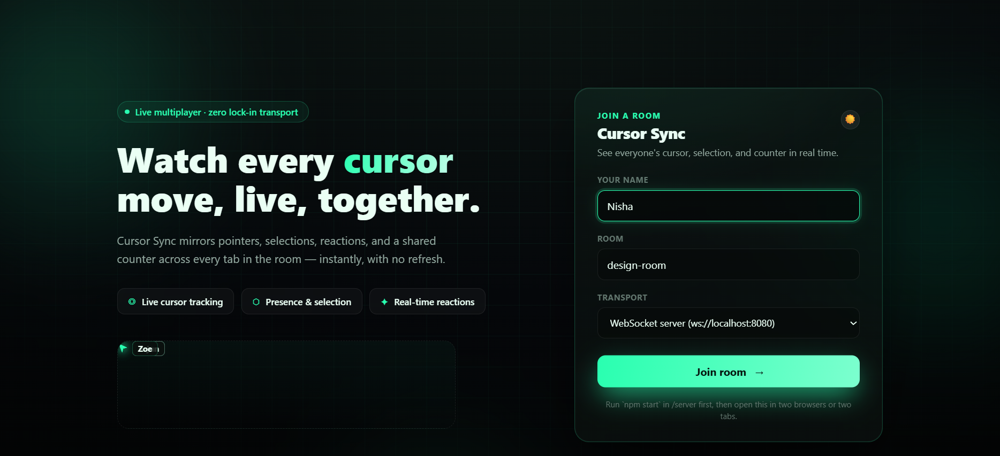
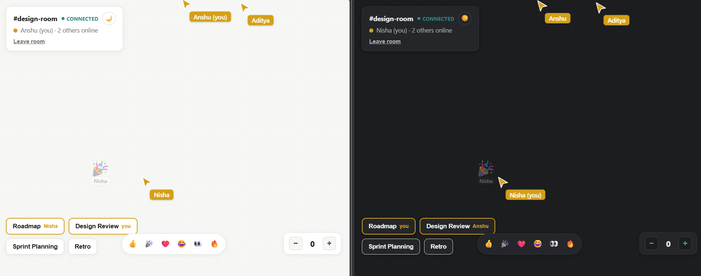

# CursorSync

> Real-time collaborative cursor synchronization with shared state, room isolation, and WebSocket-based communication.

CursorSync lets multiple users join the same room and see each other's cursor movement and shared state (selection, a counter) update live. The focus is the real-time architecture itself — transport abstraction, message protocol, state sync, disconnect handling — not a database or a third-party collaboration service.

---

## Demo

### Shared Collaboration


### Shared State Synchronization


---

## Features

- Real-time cursor movement sync (throttled + interpolated for smooth motion)
- Room-based collaboration with strict room isolation
- Transport abstraction — same client code runs over WebSocket or BroadcastChannel
- Shared card selection, synced across all clients in a room
- Shared counter using operation-based (CRDT-style) sync — concurrent updates never get lost
- Graceful leave handling + automatic disconnect detection (ping/pong + synthetic `leave`)
- Versioned message protocol with runtime validation on both client and server
- Automated WebSocket relay tests
- Strict TypeScript throughout

---

## Architecture

```text
Client A                                          Client B
┌─────────────────────┐                    ┌─────────────────────┐
│ React UI             │                    │ React UI             │
│ RoomStore             │                    │ RoomStore             │
│ WebSocketTransport   │                    │ WebSocketTransport   │
└──────────┬───────────┘                    └──────────┬───────────┘
           │                                            │
           └───────────────► WebSocket Server ◄─────────┘
                              (rooms · relay · disconnect detection)
```

The client never depends on the server directly — it talks to a `Transport` interface:

```text
React Components → RoomStore → Transport
                                  ├── WebSocketTransport        (real server, cross-device)
                                  └── BroadcastChannelTransport  (no server, same-browser demo)
```

Swapping transports is a one-line change; `RoomStore`, the protocol, and every UI component stay identical either way.

---

## Project Structure

```text
CursorSync/
├── src/
│   ├── App.tsx
│   ├── SharedCards.tsx
│   ├── SharedCounter.tsx
│   ├── CursorArrow.tsx
│   ├── CursorLayer.tsx
│   ├── interpolation.ts
│   ├── protocol.ts
│   ├── types.ts
│   ├── utils.ts
│   ├── main.tsx
│   ├── store/
│   │   └── RoomStore.ts
│   └── transport/
│       ├── Transport.ts
│       ├── WebSocketTransport.ts
│       └── BroadcastChannelTransport.ts
│
├── server/
│   ├── index.js
│   ├── test-relay.mjs
│   └── package.json
│
├── Demo-Photos/
│   ├── image1.png
│   └── image2.png
│
├── index.html
├── package.json
├── tsconfig.json
├── vite.config.ts
└── README.md
```

---

## Message Protocol

Typed, versioned messages flow between client and server:

```text
join · move · leave · select · counter
```

Every message carries `v` (protocol version), `id` (sender), `room`, `seq` (per-sender monotonic sequence), and `ts`. Both the client (`protocol.ts`) and the server (`server/index.js`) independently validate structure and room membership before a message is applied or relayed.

---

## Shared Counter — Operation-Based, Not Value-Based

Instead of broadcasting `counter = 5`, clients exchange discrete, uniquely-identified operations:

```text
Client A: +1 ──┐
Client B: +1 ──┼── relayed by server ──► every client applies both ops
               │
               ▼
        Final value = 2
```

Each op is applied exactly once, in any order (commutative + idempotent) — a minimal grow/shrink-counter CRDT. Two people clicking at the same instant never overwrite each other, which a naive "send the new total" approach would allow.

---


## Running Locally

**1. Clone and install the frontend**
```bash
git clone https://github.com/nishasharma303/CursorSync.git
cd CursorSync
npm install
```

**2. Install and start the server** (separate terminal)
```bash
cd server
npm install
npm start
```

**3. Start the frontend** (from the project root)
```bash
npm run dev
```

Open the printed localhost URL in two or more tabs, join the same room, and pick **WebSocket server** as the transport. A **BroadcastChannel demo** mode is also available from the join screen for a zero-server, same-browser test.

---
